BUBBY - A Pocket Chording Keyboard

It uses seven keys with chording patterns for input. The display makes for an excellent stand-alone training experience. It can be used as a USB HID keyboard or storage drive. This a sturdy every day carry design. Some frills, mostly function.

Features:
===

* Slim Form Factor (mm)
    * thinner than a deck of cards in all dimensions
* 240x135 color LCD
    * view typed characters 
* Note Taking
    * save to flash
    * view as USB drive
* Timer
    * chord speed practice
* ESP32-S3 based
    * future BLE wireless HID option?
* CircuitPython 
    * based on [akmnos22 one handed chording keyboad](https://www.instructables.com/One-Handed-Chording-Keyboard/)
* Adafruit Feather Compatible
    * also works with Feather RP2040 (minus display code)
* USB-C 
    * computer/tablet/phone/pi HID interface
* Battery
    * 350mAh battery w/charger

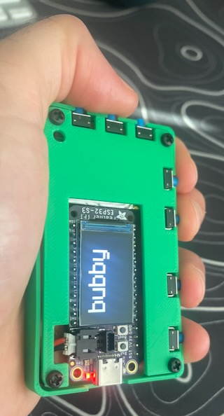

Enclosure
===

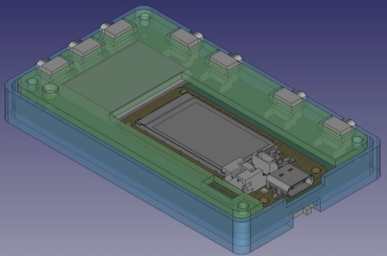

* Designed in FreeCAD 0.21.2
* Printed on Bambu Lab P1P
* Dimensions (mm):
    * 80 x 46 x 12 
* Weight:
    * 40.6 grams

PCB design
===

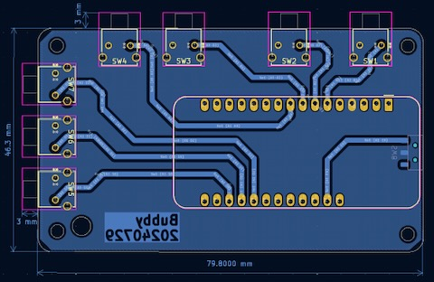

* PCB files are KiCAD 8.x

Bill of Materials
===

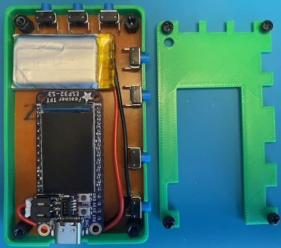

| Item       | Source     | Part Number        |
|:----------:|:----------:|:------------------:|
| Controller | Adafruit   | [Feather ESP32-S3](https://www.adafruit.com/product/5483) |
| Bat 350mAh | Adafruit   | [LiPo 3.7v ADA# 2750](https://www.adafruit.com/product/2750) |
| Buttons    | Digi-Key   | [450-1657-ND](450-1657-ND) |
| Pwr Switch | AliExpress | MSKT-12G03 |
| Screws     | Adafruit   | [M2.5 Machine Screws / Stand-off](https://www.adafruit.com/product/3299) |

Bottom
====

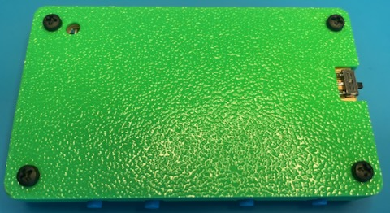

* Slim power switch on bottom.
* Keychain hole option
    * works with smaller 150mAh battery

DIY PCB
===

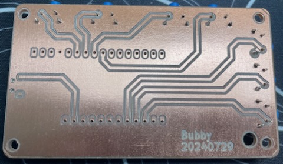

* Milled single sided on a Bantam Othermill.
    * traces PCB engraving bit 0.005 (mm)
    * drill holes 0.9 (mm)

Chords
===

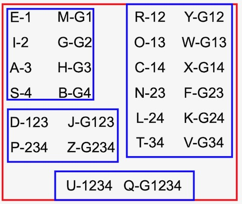

* Tested with CircuitPython 9.x

* Chording ascii table. Digits, punctuation, symbols and mofiiers are also supported with the thumb modifiers. Firmware includes 4 custom modifiers.

| Key       | Code    |
|:---------:|:-------:|
| Backspace | 124     |
| Space     | 134     |
| Clear     | B-124   |
| xxx       | B-134   |
| Save      | G-124   |
| USB       | G-134   |
| Timer     | Y-124   |
| xxx       | Y-134   |

* B - blue (inner thumb)
* G indicates center thumb (green)
* Y - yellow (outer thumb)

* white space is blue (inner thumb)
* alpha characters are green (center thumb)
* numerics are yellow (outer thumb)

Typing Speed
===

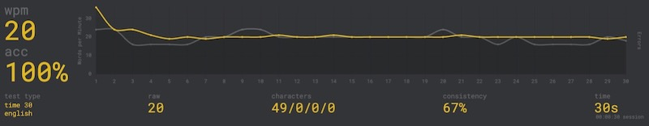

* monkeytype
* left handed :: 14 wpm
* limited by mental conversion of letters to chords

Schematic
===

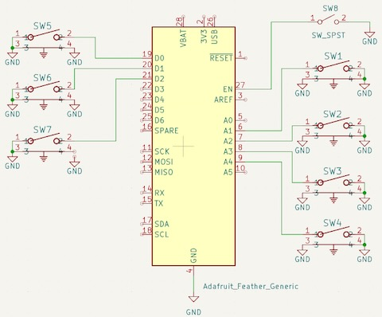

Why Bubby
===

Bubby is an affectionate nickname for a friend, peer or even grandmother (Yiddish). This pocket keyboard acting as a digital everyday carry device. It is the friend that accompanies you.

Why Chording
===

The Human <--> Machine interface has enormous potential for improvement. The most egregious issue is the keyboard. The QWERTY layout is designed to be ineffecient. Chording based keyboards have shown typing speeds exceeding 400 wpm. Douglas Engelbart a developer of early input devices attempted popularize chording in a 1968 demo. Now with VR, AR and wearables it makes sense to adapt the earlier chording designs into new discrete interfaces.

Just Why?
===

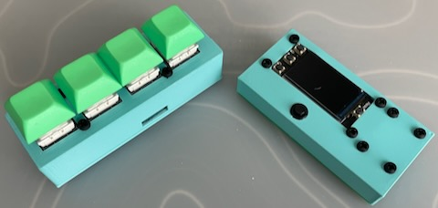

I hurt my knee. I had been running ultramarathons for ten years and had to get surgery. Immediately the twenty plus hours a week I had been putting into running were freed up. I read [Bruce Schneier's book "A Hacker's Mind"](https://www.amazon.com/Hackers-Mind-Powerful-Societys-Rules/dp/B0BP97G3NL) which describes a student reciting Pi to one hundred decimal places by using a phone vibrating morse code patterns. I was inspried and built a [BLE keyboard](https://github.com/mikeysklar/ble-morsecode-neokey) which used morse code communication. I slimmed it down into a Feather Rev TFT ESP32-S3 variation with vibrating motor and small built-in buttons. A realization came to me that I like having a self powered pocket keyboard and screen with some USB abilities. Also it would sure be nice to type faster.

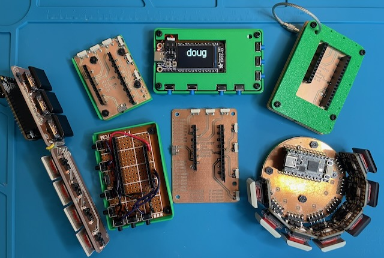

I made five variations of "bubby". I call the series "doug" after the dude who popularized chording. The first one I wired up with just a protoboard and buttons. It actually turned out the most functional of the designs. I went back to that model to make a PCB. The other versions I tried going to had irritatingly small SMT buttons that were uncomfortable and would come off. Larger keys and PCBs like the stick and ring designs which use Kailh Choc keys were to bulky and rattled. Study and compact won out. 
