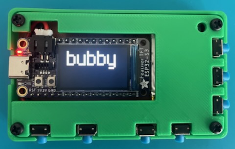

A Pocket Chording Keyboard

BUBBY is a compact one handed keyboard that fits in your pocket. It uses seven keys with chording patterns for input. The display makes an excellent stand-alone training device. It can be used as a USB HID keyboard or storage key. This a sturdy every day carry design. Some frills, mostly function.

Features:
===

* Slim Form Factor (mm)
    * thinner than a deck of cards in all dimensions
* 240x135 color LCD
    * view typed characters 
* notes
    * save to flash
    * view as USB drive
* Timer
    * chord speed practice
* ESP32-S3 based
    * future BLE wireless HID option?
* CircuitPython 
    * based on [akmnos22 one handed chording keyboad](https://www.instructables.com/One-Handed-Chording-Keyboard/)
* Adafruit Feather Compatible
    * also works with Feather RP2040 (minus display code)
* USB-C 
    * optional computer/tablet/phone/pi HID interface
    * 350mAh battery w/charger

Enclosure
===

* Designed in FreeCAD 0.21.2
* Printed on Bambu Lab P1P
* Dimensions (mm):
    * 80 x 46 x 12 
* Weight:
    * 40.6 grams

PCB design
===

* PCB files are KiCAD 8.x

Bill of Materials
===

| Item       | Source     | Part Number        |
|:----------:|:----------:|:------------------:|
| Controller | Adafruit   | [Feather ESP32-S3](https://www.adafruit.com/product/5483) |
| Bat 350mAh | Adafruit   | [LiPo 3.7v ADA# 2750](https://www.adafruit.com/product/2750) |
| Buttons    | Digi-Key   | [450-1657-ND](450-1657-ND) |
| Pwr Switch | AliExpress | MSKT-12G03 |
| Screws     | Adafruit   | [M2.5 Machine Screws / Stand-off](https://www.adafruit.com/product/3299) |

Bottom
====

* Slim power switch on bottom.
* Keychain hole option
    * works with smaller 150mAh battery

DIY PCB
===

* Milled single sided on a Bantam Othermill.
    * traces PCB engraving bit 0.005 (mm)
    * drill holes 0.9 (mm)

Chords
===

* Tested with CircuitPython 9.x

* Chording ascii table. Digits, punctuation, symbols and mofiiers are also supported with the thumb modifiers. Firmware includes 4 custom modifiers.

| Key       | Code    |
| Backspace | 124     |
| Space     | 134     |
| Clear     | B-124   |
| xxx       | B-134   |
| Save      | G-124   |
| USB       | G-134   |
| Timer     | Y-124   |
| xxx       | Y-134   |

* B - blue (inner thumb)
* G indicates center thumb (green)
* Y - yellow (outer thumb)

* white space tends to be blue (inner thumb)
* almost all characters are either no thumb or green (center thumb)
* numerics are yellow (outer thumb)
  
Schematic
===

<<<<<<< HEAD

Why Bubby
===

Bubby is an affectionate nickname for a friend, peer or even grandmother (Yiddish). This pocket keyboard acting as a digital everyday carry device is the friend you take with you.

Why Chording
===

The Human <--> Machine interface can be improved in many areas.The most egregious issue is the keyboard. The qwerty layout is designed to be ineffecient. Chording based keyboards have lead to typing speeds of over 400 wpm. Douglas Engelbart a developer of early input devices attempted popularize chording in a 1968 demo. Now with VR, AR and always connected devices it makes sense to adapt the earlier chording designs into a discrete interface. 
=======
>>>>>>> 65024bedfe982452b26539e4eac40c9507588452
